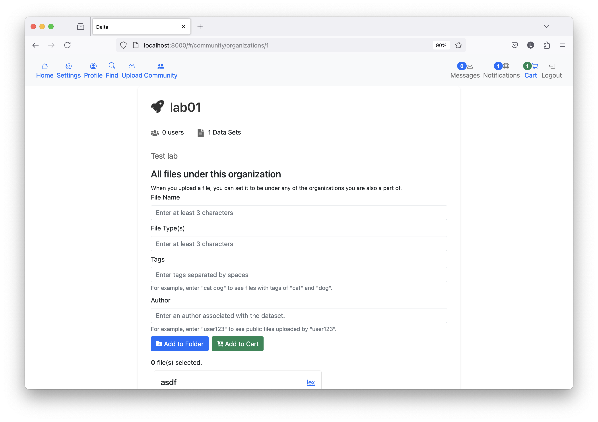
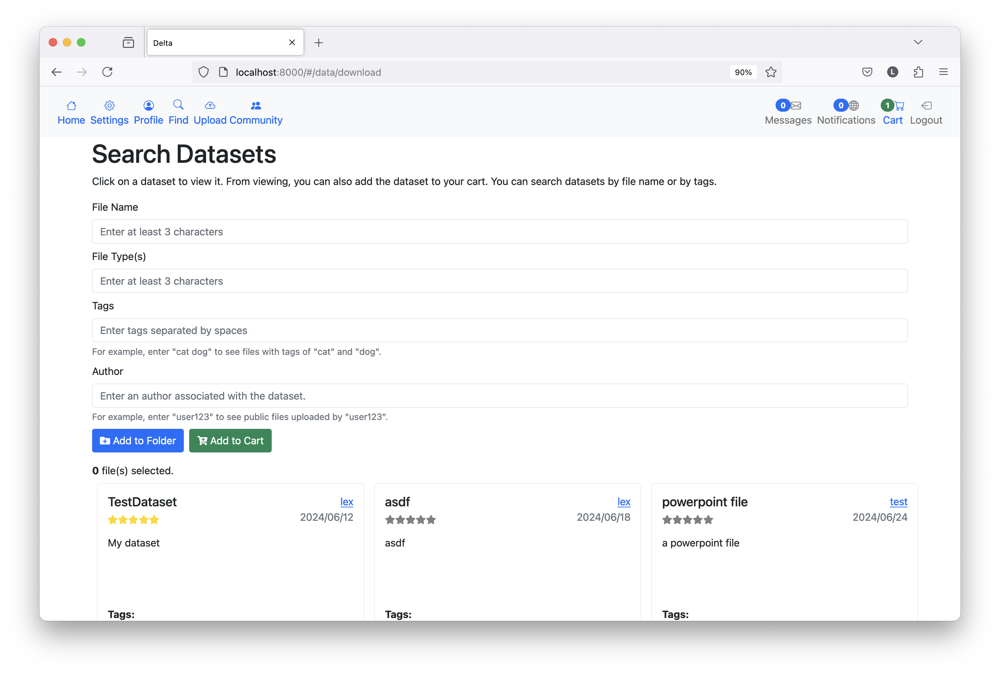
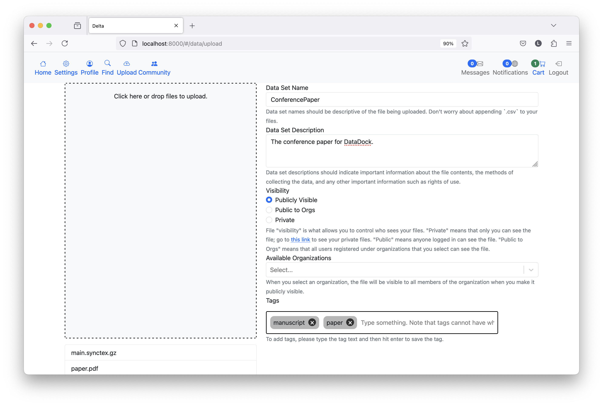

# What is it ❓
DataDock is a web file system designed for use by researchers and data scientists. It is essentially a file transfer system with a social media and market aspect. Researchers or data scientists can perform CRUD operations on data, and can also assess the validity of data by creating posts on data sets or ML models or by rating data sets or ML models. 

### Presentation
We are happy to announce that the service will be presented at

`The 20th International Conference on Data Science
    (ICDATA'24: July 22-25, 2024; Las Vegas, USA`

### Video 📹
[Here](#) is a short video describing how to use the system. We will update this tutorial as more features are added over time.

### NOTE: Name Change
Please note that DataDock used to be called Delta. We are working on renaming the files accordingly. At the moment, there may be some directories / files with Delta in the name.

# Screenshots
Below are some images of the service.

### Cart

### Conversations

### Organizations

### Reviews

### Notification

### Search

### Upload

# Running 🏃
Note the following instructions are designed for *nix machines.

To run, first clone the repository by running:
`git clone https://github.com/lxaw/DataDock` 

Then cd into `DataDock`. 

You should have installed `pipenv`. Install following `https://pipenv.pypa.io/en/latest/install/` or some other resource online.

When installed, you should be able to run 
`pipenv sync` to sync the pipenv file, and then `pipenv install` to install dependencies.

To run the backend, cd into `delta_web` with `cd delta_web`.
Change directory into `delta` with `cd delta`.

The currect working directory should be something like:
`[OTHER_DIRECTORIES]/DataDock/delta_web/delta/`

Then run `pipenv run python3 manage.py runserver`. Now the backend should be running.

To set up `npm`, from the same directory as prior cd into `frontend`. 
Install the necessary JavaScript requirements with `npm i`. 

On terminal two, type:
`npm run dev` to begin the front end server.

To view the website, open up a browser and type in the url `localhost:8000`. You should be directed to a login screen.

## External Requirements 💾
In order to build this project, you will first have to install:

- The latest version of Node.js: https://nodejs.org/en/download/
- You can run `sudo apt update` then `sudo apt install nodejs npm`
- See [here](https://linuxize.com/post/how-to-install-node-js-on-ubuntu-20-04/)
- The latest version of Python: https://www.python.org/downloads/
- You can run `sudo apt update` then `sudo apt install python3`
- See [here](https://www.makeuseof.com/install-python-ubuntu/)

# Testing 🧪
Testing the DataDock application includes more than a dozens unit and behavioral tests. To accomplish this, we
use a combination of testing libraries, which are listed below.

## Testing Technology 💻
For behavioral tests we use [Jest](https://reactjs.org/docs/testing.html).

For unit tests we use the standard Django testing framework. You can read more on that [here](https://docs.djangoproject.com/en/4.1/topics/testing/overview/)

### Running Unit tests 📝
All unit tests are found in subdirectories of the the delta directory
`/DataDock/delta_web/delta`

Be sure to be in this directory when running the following commands to perform unit tests.

To run the whole test suite, type `pipenv run python3 manage.py test`. From there the terminal will show what tests are found, 
what pass, and what warnings or errors are shown. You may also run individual unit tests or directories. 

##### Different commands for testing
Whole test suite: `pipenv run python3 manage.py test`

Test directory: `pipenv run python3 manage.py test accounts/`

A specific test: `pipenv run python3 manage.py test [directory_name.test_directory_name.TestCaseName.specific_test_name]` i.e. 
`pipenv run python3 manage.py test accounts.tests.RegistrationTestCase.test_registration`

Unit tests run against APIs in the following sub-directories:
- accounts/
-- This is under the `tests.py` file.
- data/
-- This is under the `tests.py` file.
- organizations/
-- This is under the `tests.py` file.
- social/
-- This is slightly different and under the `tests` folder. Within this folder are the test models (`test_models.py`), the test setup (`test_setup.py`) and the test views (`test_views.py`).

### Running Behavioral tests:
Behavioral tests are performed using [Jest](https://jestjs.io/). You can read more on how Jest is used with React [here](https://reactjs.org/docs/testing.html).

All the behavioral tests can be found in 
`/DataDock/delta_web/delta/frontend/tests/`

When running behavior tests, be sure to be in the following directory:

`/DataDock/delta_web/delta/frontend/`

To run the tests, from the above directory type
`npm run coverage`.

From there the terminal will show what tests are found, what pass, and what warnings or errors are shown.

Note that when making a behavioral test with Jest the JS file must have a `.test.js` extension. 

### Support ❤️
- DataDock is an ambitious project. As such, there are many things that can be added. Please feel free to open an issue for something you think may be useful. This is intended to be a community project.
